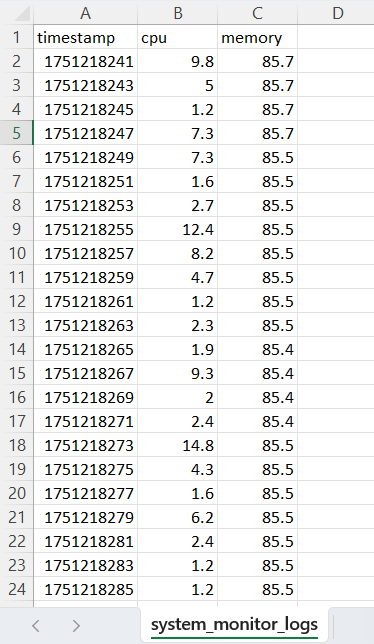

# System Resource Monitor (Python CLI Tool)

A lightweight, real-time system monitoring tool built in Python.  
Tracks CPU and memory usage, supports live plotting, logs data to CSV, and handles graceful shutdown — all via a simple command-line interface.

---

## Features

- Background thread for CPU + memory sampling
- In-memory ring buffer using `collections.deque`
- Live plotting using `matplotlib`
- Save log to CSV anytime
- View last 5 entries with `summary`
- Graceful shutdown with `Ctrl+C`
- Modular structure (`monitor.py`, `main.py`, `utils.py`, `live_plot.py`)

---

## Tech Stack

- Python 3.x
- `psutil` (for resource monitoring)
- `matplotlib` (for live plotting)
- `collections.deque` (for efficient data handling)
- `threading`, `signal`, `csv`, `time`

---

## Project Structure

# system_monitor/
# ├── main.py # CLI interface and command loop
# ├── monitor.py # Background monitor thread
# ├── live_plot.py # Live graph plotting
# ├── utils.py # Summary + save functions
# ├── system_monitor_logs.csv #Log file (optional)

---

## How to Run

### 1. Install dependencies

pip install psutil matplotlib

### 2. Run the program

python main.py

### 3. Use the commands

# start     → start monitoring
# stop      → stop monitoring
# summary   → print last 5 readings
# save      → save log to monitor_log.csv
# plot      → live graph of recent usage
# quit      → exit the program

# Press Ctrl+C anytime to cleanly stop monitoring.

---

---

### Why This Project?

Built to explore:

- Thread safety in CLI apps
- Signal handling (KeyboardInterrupt)
- Memory-safe live logging using deque
- Visualization of system data

